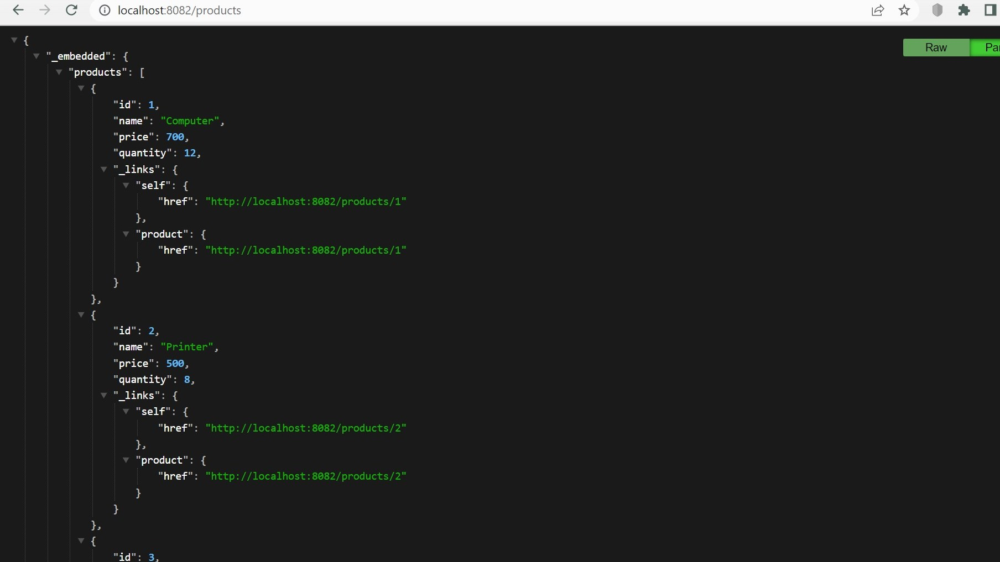
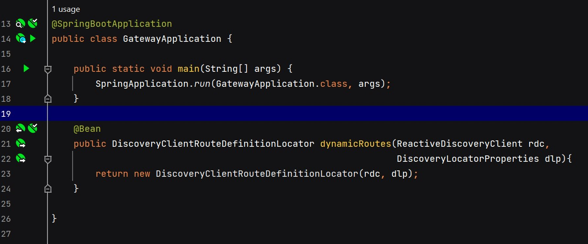

<h1>Micro-services avec Spring Cloud</h1>

<h3>I. Architecture du projet</h3>

<h3>II. Création du service Customer</h3>
     <h4>A. Composants</h4>
          La création ce micro-service comporte :
          <h4>1. l'entité Customer : élément qui sera géré par le micro-service,
          on y définit ses attributs notamment son id, son nom et son email</h4>
          <h4>2. l'interface CustomerRepository : elle permet l'accès aux données</h4>
          <h4>3. l'alimentation de la couche Application de démarrage  : contient des données insérées manuellement</h4>
          <h4>4. la configuration de l'application  : contient les propriétés nécessaires pour le démarrage de l'application</h4>
          <h4>5. une projection CustomerProjection de la classe Customer  : qui permet de récupérer des données précises et non l'intégralité</h4>
     <h4>B. Illustration de la base des données avec H2 Database</h4>
     
     <h4>C. Résultat du micro-service Customer-service avec le navigateur Google Chrome en format Json</h4>
     
     Il y a récupération de toutes les données : l'id, le nom et l'email
     <h4>D. Résultat de la projection CustomerProjection du micro-service Customer-service</h4>
     
     Il y a récupération de données mais exclusivement celles spécifiées dans la partie code de la projection : l'id et le nom

<h3>III. Création du service Inventory</h3>
     <h4>A. Composants</h4>
          La création ce micro-service comporte :
          <h4>1. l'entité Product : élément qui sera géré par le micro-service,
          on y définit ses attributs notamment son id, son nom, son prix et sa quantité</h4>
          <h4>2. l'interface ProductRepository : elle permet l'accès aux données</h4>
          <h4>3. l'alimentation de la couche Application de démarrage  : contient des données insérées manuellement</h4>
          <h4>4. la configuration de l'application  : contient les propriétés nécessaires pour le démarrage de l'application</h4>
     <h4>B. Illustration de la base des données avec H2 Database</h4>
     
     <h4>C. Résultat du micro-service Inventory-service en format Json avec le navigateur Google Chrome</h4>
     
     Il y a récupération de toutes les données : l'id, le nom, le prix et la quantité

<h3>IV. Création de la gateway Spring Cloud</h3>
     

<h3>V. Création du service Eureka Discovery</h3>
     <h4>A. La notation @EnableEurekaServer permet d'activer le service Discovery</h4>
     
     <h4>B. Disponibilités des micro-services via Eureka Discovery</h4>
     
     <h4>C. Résultat du micro-service Customer-service via la Gateway</h4>
     
     <h4>D. Résultat du micro-service Inventory-service via la Gateway</h4>
     

<h3>VI. Configuration dynamique des routes de la gateway</h3>
     

<h3>VII. Création du service Billing</h3>
     <h4>A. Base de données bill-db</h4>
     
     
     <h4>B. Résultat en format Json du micro-service Billing-service</h4>
     
     Ici, on aperçoit une facture d'un client avec les différents produits achétés
     
     On aperçoit l'ensemble des factures des tous les clients

